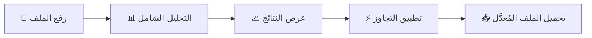

# 🚀 خطة تطوير Version 2 — دعم رفع الملفات والتحليل الشامل

---

## 📌 الهدف العام
تحويل المنصة من أداة تحليل نصوص يدوية إلى **منصة شاملة** تدعم رفع الملفات (PDF, DOCX, TXT)، تحليلها بالكامل، عرض نسبة الذكاء الاصطناعي المكتشفة، ثم تطبيق التجاوز وتحميل الملف المُعدَّل.

---

## 🔄 سير العمل المُستهدَف (User Flow)



| الخطوة | الوصف |
|--------|-------|
| **1. رفع الملف** | المستخدم يرفع ملف (PDF / DOCX / TXT) أو يلصق النص يدوياً |
| **2. التحليل** | النظام يستخرج النص ويحلل كل فقرة على حدة + النص الكامل |
| **3. عرض النتائج** | عرض نسبة AI لكل فقرة (تلوين أحمر/أصفر/أخضر) + النتيجة الإجمالية |
| **4. التجاوز** | تطبيق محرك التجاوز على الفقرات المكتشفة فقط أو النص كامل |
| **5. التحميل** | تحميل الملف المعدَّل بنفس الصيغة الأصلية |

---

## 📋 المراحل التفصيلية المستحدثة

### المرحلة 1: محرك استخراج النصوص المتقدم (Backend)
> **الملف:** `engine/file_parser.py`

| المهمة | التفاصيل |
|--------|----------|
| الحفاظ على هيكل الملف | استخراج النص مع تحديد **أماكن الصور بدقة** كعلامات مرجعية (Placeholders) |
| دعم DOCX | استخدام `python-docx` لقراءة الفقرات والصور بالترتيب |
| دعم PDF | استخدام `PyMuPDF` (fitz) أو `pdfplumber` لاستخراج النص مع إحداثيات الصور |
| دعم TXT | قراءة مباشرة (لا يحتوي على صور) |
| تقسيم ذكي | تقسيم النص إلى فقرات مع ربط كل فقرة بموقعها بالنسبة للصور المجاورة |

**المكتبات المطلوبة:**
```
python-docx
PyMuPDF (fitz)
```

---

### المرحلة 2: التحليل الفقري (Paragraph-Level Analysis)
> **الملف:** `engine/text_analyzer.py` (تحسين)

| المهمة | التفاصيل |
|--------|----------|
| تحليل كل فقرة | تطبيق `full_analysis()` على كل فقرة منفردة (متجاهلاً علامات الصور) |
| خريطة حرارية | تصنيف كل فقرة: 🟢 بشري (68+) / 🟡 رمادي (42-68) / 🔴 AI (0-42) |
| النتيجة الإجمالية | المتوسط المرجح للنتيجة |

---

### المرحلة 3: التجاوز الذكي مع الوعي بالصور (Image-Aware Bypass)
> **الملف:** `engine/bypass_engine.py` (تحسين)

| المهمة | التفاصيل |
|--------|----------|
| تجاوز انتقائي | معالجة الفقرات التي سجّلت نسبة عالية للذكاء الاصطناعي فقط |
| الحفاظ على الصور | **عدم المساس بعلامات الصور المرجعية.** النص المُعدَّل يحل محل النص القديم (قبل أو بعد الصورة) بنفس الترتيب الهيكلي تماماً |

---

### المرحلة 4: إعادة تجميع الملف (Smart Export)
> **الملف:** `engine/file_exporter.py`

| المهمة | التفاصيل |
|--------|----------|
| دمج النص والصور | استبدال النص الأصلي بالنص المُعدل مع **إبقاء الصور في أماكنها الأصلية تماماً** |
| تصدير DOCX | تعديل فقرات ملف الـ Word الأصلي مباشرةً (in-place modification) لضمان عدم تحرك الصور |
| تصدير PDF | أصعب تقنياً. سيتم تحويل النص وتوليد PDF جديد مع إدراج الصور المستخرجة في إحداثيات مقاربة، أو إرجاع DOCX منسق |

---

### المرحلة 5: واجهة المستخدم المدمجة (Frontend)
> **الملفات:** `templates/index.html` + `static/style.css`

| المهمة | التفاصيل |
|--------|----------|
| الإبقاء على القديم | **إبقاء منطقة النص الحالية (Textarea) كما هي تماماً.** |
| إضافة منطقة الرفع | إضافة نافذة أو قسم جانبي / علوي خاص بـ "رفع الملفات" (Drag & Drop) |
| التبديل السلس | يمكن للمستخدم استخدام النص اليدوي أو رفع ملف في نفس الواجهة |
| شريط التقدم | شريط تحميل يوضح (جاري الاستخراج -> التحليل -> التجاوز -> تجميع الصور) |

---

## 🗂️ هيكل الملفات بعد التطوير

```
📁 المشروع/
├── app.py                          ← (تحديث: endpoints جديدة)
├── requirements.txt                ← (تحديث: PyMuPDF, python-docx)
├── engine/
│   ├── arabic_resources.py         
│   ├── text_analyzer.py            
│   ├── bypass_engine.py            
│   ├── file_parser.py              ← ✨ استخراج النص + أماكن الصور
│   └── file_exporter.py            ← ✨ دمج النص المعدل مع الصور الأصلية
├── static/
│   ├── style.css                   ← (تحديث: إضافة قسم الرفع بجانب النص)
│   └── app.js                      
├── templates/
│   └── index.html                  ← (تحديث: قسم الرفع + Textarea القديم)
└── uploads/                        
```

---

## 🔌 الـ API Endpoints الجديدة

| Method | Endpoint | الوظيفة |
|--------|----------|---------|
| `POST` | `/api/upload` | رفع الملف، استخراج النص والصور، وإرجاع التحليل |
| `POST` | `/api/bypass-file` | تطبيق التجاوز مع الحفاظ على هيكل الصور |
| `GET`  | `/api/download/<id>` | تحميل الملف المُعدَّل مع الصور |

---

> [!IMPORTANT]
> التحدي الأكبر هنا هو **الـ PDF** لأن تعديل النص بداخله دون كسر تنسيق الصور معقد جداً. لذلك، بالنسبة للملفات التي تحتوي صور: **يفضل استخدام صيغة DOCX** لأنها تسمح بتعديل الفقرات نصياً مع إبقاء الصور (In-place edit) بدقة 100%. سيتم دعم DOCX كأولوية قصوى للحفاظ على الصور.
